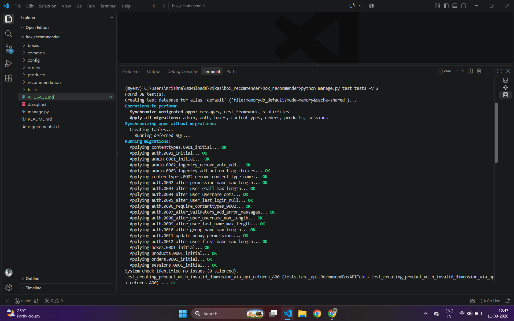
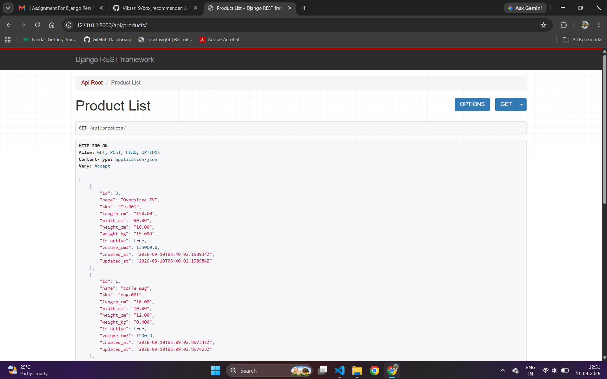
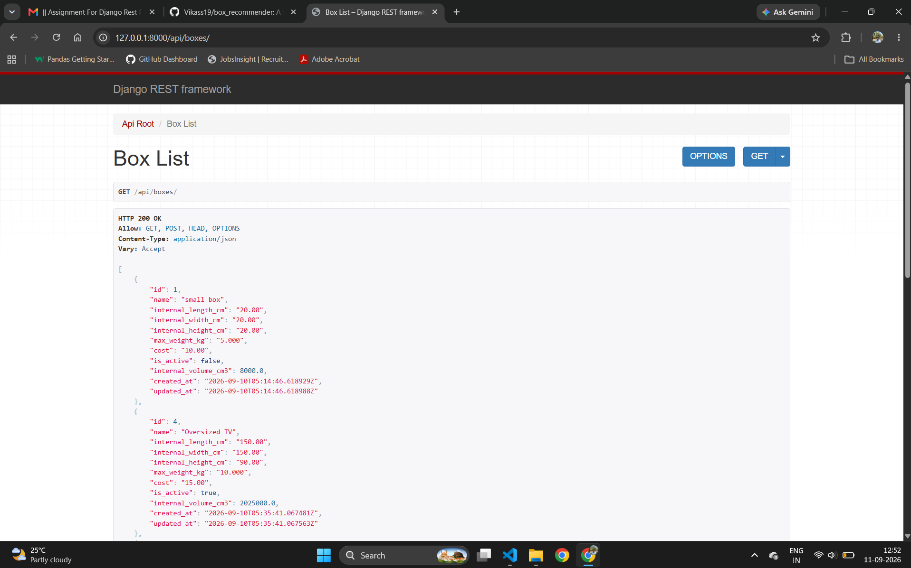

# TEST OUTPUT

## 1. Test Case — GET Products


### Terminal Output

# test cases output



getting all aviable products
GET /api/products/
Status: 200 OK



gettingn all boxes
GET /api/box/
Status: 200 OK




```box recommends for product
GET /api/box/
Status: 200 OK

(screenshots/recommend_box.png)
